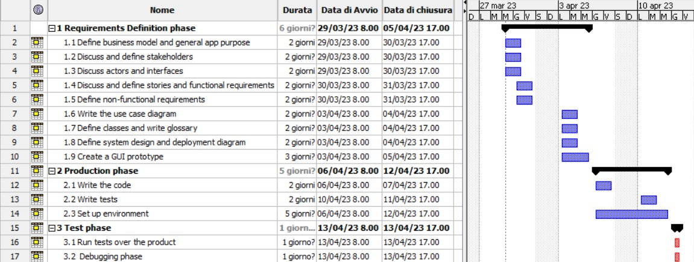

# Project Estimation - CURRENT
Date: 15/04/2023

Version: 5

# Estimation approach
Consider the EZWallet  project in CURRENT version (as received by the teachers), assume that you are going to develop the project INDEPENDENT of the deadlines of the course

# Estimate by size
### MODELS
|                                                                                                         | Estimate           |
|:--------------------------------------------------------------------------------------------------------|:-------------------|
| NC =  Estimated number of classes to be developed                                                       | 9 (models + apis)  |
| A = Estimated average size per class, in LOC                                                            | 36  LOC            |
| S = Estimated size of project, in LOC (= NC * A)                                                        | 323 LOC            |
| E = Estimated effort, in person hours (here use productivity 10 LOC per person hour)                    | 33 person hours    |
| C = Estimated cost, in euro (here use 1 person hour cost = 30 euro)                                     | 990 €              |
| Estimated calendar time, in calendar weeks (Assume team of 4 people, 8 hours per day, 5 days per week ) | 0.2 calendar weeks |

# Estimate by product decomposition
### 
| component name       | Estimated effort (person hours) |             
|----------------------|---------------------------------| 
| requirement document | 24                              |
| GUI prototype        | 24                              |
| design document      | 10                              |
| code                 | 16                              |
| unit tests           | 8                               |
| api tests            | 8                               |
| management documents | 10                              | 

# Estimate by activity decomposition
### 
| Activity name                 | Estimated effort (person hours) |             
|-------------------------------|---------------------------------| 
| Requirements definition phase | 48                              |
| Production phase              | 40                              |
| Test phase                    | 8                               |

### *More details about the activities in Gantt Chart*

###

# Summary

Report here the results of the three estimation approaches. The  estimates may differ. Discuss here the possible reasons for the difference

|                                    | Estimated effort | Estimated duration |          
|------------------------------------|------------------|--------------------|
| estimate by size                   | 8.2 hours        | 2 calendar days    |
| estimate by product decomposition  | 100 hours        | 12.5 calendar days |
| estimate by activity decomposition | 96 person hours  | 12 person days     |

