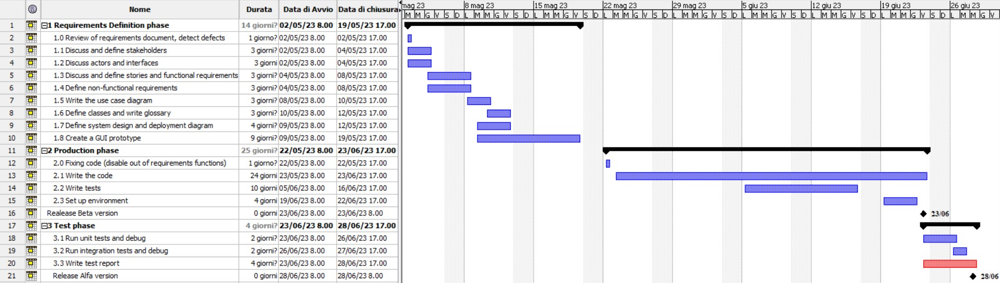

# Project Estimation - FUTURE
Date: 28/04/2023

Version: 4

# Estimation approach
Consider the EZWallet  project in FUTURE version (as proposed by the team), assume that you are going to develop the project INDEPENDENT of the deadlines of the course
# Estimate by size
### 
|                                                                                                         | Estimate           |             
|---------------------------------------------------------------------------------------------------------|--------------------|  
| NC =  Estimated number of classes to be developed                                                       | 27                 |             
| A = Estimated average size per class, in LOC                                                            | 200 LOC            | 
| S = Estimated size of project, in LOC (= NC * A)                                                        | 5400 LOC           |
| E = Estimated effort, in person hours (here use productivity 10 LOC per person hour)                    | 540 person hours   |   
| C = Estimated cost, in euro (here use 1 person hour cost = 30 euro)                                     | 16.200€            | 
| Estimated calendar time, in calendar weeks (Assume team of 4 people, 8 hours per day, 5 days per week ) | 3,4 calendar weeks |               

# Estimate by product decomposition

| component name       | Estimated effort (person hours) |             
|----------------------|---------------------------------| 
| requirement document | 50                              |
| GUI prototype        | 70                              |
| design document      | 30                              |
| code                 | 135                             |
| unit tests           | 40                              |
| api tests            | 40                              |
| management documents | 30                              |

# Estimate by activity decomposition

| Activity name                 | Estimated effort (person hours) |             
|-------------------------------|---------------------------------| 
| Requirements definition phase | 112                             |
| Production phase              | 200                             |
| Test phase                    | 32                              |

### *More details about the activities in Gantt Chart*

# Summary

Report here the results of the three estimation approaches. The  estimates may differ. Discuss here the possible reasons for the difference

|                                    | Estimated effort               | Estimated duration |          
|:-----------------------------------|:-------------------------------|:-------------------|
| estimate by size                   | 135 hours                      | 17 calendar days   |
| estimate by product decomposition  | 395 hours                      | 49 calendar days   |
| estimate by activity decomposition | 344 hours                      | 43 calendar days   |

