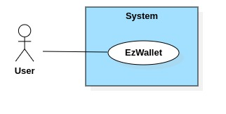
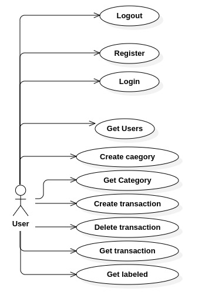
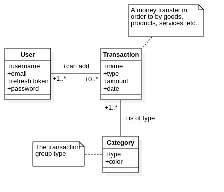
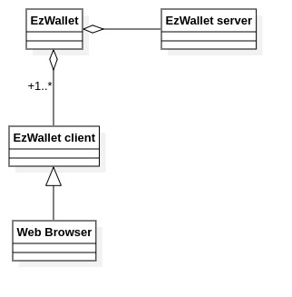
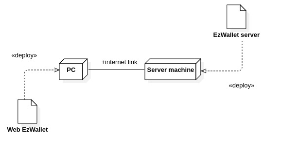

# Requirements Document - current EZWallet

Date:

Version: V1 - description of EZWallet in CURRENT form (as received by teachers)

| Version number | Change    |
|----------------|:----------|
| V1             | No Change | 

# Contents

- [Informal description](#informal-description)
- [Stakeholders](#stakeholders)
- [Context Diagram and interfaces](#context-diagram-and-interfaces)
	+ [Context Diagram](#context-diagram)
	+ [Interfaces](#interfaces)

- [Stories and personas](#stories-and-personas)
- [Functional and non functional requirements](#functional-and-non-functional-requirements)
	+ [Functional Requirements](#functional-requirements)
	+ [Non functional requirements](#non-functional-requirements)
- [Use case diagram and use cases](#use-case-diagram-and-use-cases)
	+ [Use case diagram](#use-case-diagram)
	+ [Use cases](#use-case---register)
		+ [Relevant scenarios](#use-case---register)
- [Glossary](#glossary)
- [System design](#system-design)
- [Deployment diagram](#deployment-diagram)
- [Defects](#defects)

# Informal description
EZWallet (read EaSy Wallet) is a software application designed to help individuals and families keep track of their expenses. Users can enter and categorize their expenses, allowing them to quickly see where their money is going. EZWallet is a powerful tool for those looking to take control of their finances and make informed decisions about their spending.

# Stakeholders

| Stakeholder name  |                                                  Description                                                  | 
|-------------------|:-------------------------------------------------------------------------------------------------------------:|
| User              |                                      It is the client who uses the app.                                       |

# Context Diagram and interfaces

## Context Diagram

## Interfaces

| Actor | Logical Interface | Physical Interface |
|-------|:------------------|--------------------|
| User  | GUI               | PC/Smartphone      |

# Stories and personas

Persona 1: Extra-EU student, Male, Not Married, ~23y, Low income  
Story 1: Wants to know how much costs living (monthly) in EU. Needs to write expenses

Persona 2: Professor, Male, Married, One child, ~42y, Stable salary with non-stable incomes from projects (or research)
Story 2: Wants to calculate monthly income and outcome such that can he afford new car

Persona 3: Elderly, Divorced, Not living with child, ~67, Retire, Low Stable income from pension
Story 3: Wants to know can he have a dog with his income. Wants to count monthly expenses

# Functional and non functional requirements

## Functional Requirements

| ID    |                 Description                 |
|-------|:-------------------------------------------:|
| FR1   |         Authorize and authenticate          |
| FR1.1 |                  Register                   |
| FR1.2 |                    Login                    |
| FR1.3 |                   Logout                    |
| FR1.4 |       Refresh session (refreshToken)        |
| FR2   |             Account management              |
| FR2.1 |               Create category               |
| FR2.2 |               Get categories                |
| FR2.3 |             Create transaction              |
| FR2.3 |             Delete transaction              |
| FR2.3 | Get labels (transaction + category details) |
| FR2.4 |              Get profile info               |
| FR3   |               User management               |
| FR3.1 |                Get all users                |
| FR3.2 |                  Get user                   |

## Non Functional Requirements

| ID   | Type (efficiency, reliability, ..) |                                                 Description                                                 | Refers to |
|------|:----------------------------------:|:-----------------------------------------------------------------------------------------------------------:|----------:|
| NFR1 |             Usability              |                                    The GUI must be simple and intuitive                                     |    all FR |
| NFR2 |            Correctness             |                    The amount of the expensive must be equal to the sum of the expenses                     |    all FR |
| NFR3 |             Efficiency             |                    The transactions must be fast and the data must be collected quickly                     |    all FR |
| NFR4 |            Reliability             |                           The software crashes have to be <0.01% of interactions                            |    all FR |
| NFR5 |          Maintainability           |                              The software must be easy to maintain and modular                              |    all FR |
| NFR5 |              Security              |                                Data can only be accessed by authorized users                                |    all FR |
| NFR6 |             Usability              | The user must be able to distinguish transaction categories and easily determine the amount of the expenses |    all FR |
| NFR7 |           Dependability            |                       Information available must be correct, available and consistent                       |    all FR |
| NFR8 |              Security              |             Password must never be stored in clear. Sensitive data must not be saved in clear.              |    all FR |

# Use case diagram and use cases

## Use case diagram

### Use case - Register
| Actors Involved  |                             User                              |
|------------------|:-------------------------------------------------------------:|
| Precondition     |                    User registered - False                    |
| Post condition   |                    New User Created - True                    |
| Nominal Scenario |                        User Registered                        |
| Exceptions       | Existing account/email, wrong email/password/username formats |

#### Scenario - Register
| Step |                Description                |
|------|:-----------------------------------------:|
| 1    |           User ask to register            |
| 2    | System asks email, username, and password |
| 3    |         User enter needed values          |
| 4    |   System check email/password validity    |
| 5    |          System creates new user          |

### Use case - Login
| Actors Involved  |                       User                       |
|------------------|:------------------------------------------------:|
| Precondition     |              User registered - True              |
| Post condition   |              User authorized - True              |
| Nominal Scenario |                   User logins                    |
| Exceptions       | Not existing account/email, wrong email/password |

#### Scenario - Login
| Step               |             Description              |
|--------------------|:------------------------------------:|
| 1                  |          User ask to Login           |
| 2                  |    System asks email and password    |
| 3                  |      User enters needed values       |
| 4                  | System check email/password validity |

### Use case - Logout
| Actors Involved  |          User           |
|------------------|:-----------------------:|
| Precondition     | User authorized - True  |
| Post condition   | User authorized - False |
| Nominal Scenario |       User logout       |

#### Scenario - Logout
| Step               |             Description              |
|--------------------|:------------------------------------:|
| 1                  |          User ask to logout          |
| 2                  |         System logouts user          |

### Use case - Create Category
| Actors Involved  |           User            |
|------------------|:-------------------------:|
| Precondition     |  User authorized - True   |
| Post condition   |  Category Created - True  |
| Nominal Scenario | User creates new category |
| Exceptions       |    User not authorized    |

#### Scenario - Create Category
| Step |           Description           |
|------|:-------------------------------:|
| 1    |   User ask to create category   |
| 2    | System asks values(type, color) |
| 3    |    User sends needed values     |
| 4    |     System creates category     |

### Use case - Get Category
| Actors Involved  |             User             |
|------------------|:----------------------------:|
| Precondition     |    User authorized - True    |
| Nominal Scenario | User gets list of categories |
| Exceptions       |     User not authorized      |

#### Scenario - Get Category
| Step |           Description           |
|------|:-------------------------------:|
| 1    |    User ask list of category    |
| 2    | System sends list of categories |

### Use case - Create Transaction
| Actors Involved  |                   User                    |
|------------------|:-----------------------------------------:|
| Precondition     |          User authorized - True           |
| Post condition   |        Transaction created - True         |
| Nominal Scenario |         User creates transaction          |
| Exceptions       | User not authorized, wrong entered values |

#### Scenario - Create Transaction
| Step |           Description            |
|------|:--------------------------------:|
| 1    |  User ask to create transaction  |
| 2    | System asks user to enter values |
| 3    |    User enters needed values     |
| 3.1  |   User choose needed category    |
| 4    |    System creates transaction    |

### Use case - Delete Transaction
| Actors Involved  |                     User                      |
|------------------|:---------------------------------------------:|
| Precondition     |            User authorized - True             |
| Post condition   |          Transaction Deleted - True           |
| Nominal Scenario |           User deletes transaction            |
| Exceptions       | User not authorized, not existing transaction |

#### Scenario - Delete Transaction
| Step |                     Description                      |
|------|:----------------------------------------------------:|
| 1    |            User ask to delete transaction            |
| 2    | System asks user to choose transaction to be deleted |
| 3    |               User chooses transaction               |
| 4    |              System deletes transaction              |

### Use case - Get Transaction
| Actors Involved  |             User              |
|------------------|:-----------------------------:|
| Precondition     |    User authorized - True     |
| Nominal Scenario | User gets list of transaction |
| Exceptions       |      User not authorized      |

#### Scenario - Get Transaction
| Step |            Description            |
|------|:---------------------------------:|
| 1    |   User ask list of transactions   |
| 2    | System sends list of transactions |

### Use case - Get Labeled
| Actors Involved  |                       User                        |
|------------------|:-------------------------------------------------:|
| Precondition     |              User authorized - True               |
| Nominal Scenario | User gets list of transaction grouped by category |
| Exceptions       |                User not authorized                |

#### Scenario - Get Labeled
| Step |                 Description                 |
|------|:-------------------------------------------:|
| 1    |   User ask list of transactions (labeled)   |
| 2    | System sends list of transactions (labeled) |

### Use case - Get Users
| Actors Involved  |             User              |
|------------------|:-----------------------------:|
| Precondition     |             None              |
| Nominal Scenario |    User gets list of users    |
| Exceptions       | None(see [defects](#defects)) |

#### Scenario - Get Users
| Step |                         Description                         |
|------|:-----------------------------------------------------------:|
| 1    |                 User requests list of Users                 |
| 2    | System sends list of transactions (see [defects](#defects)) |

# Glossary

# System Design

# Deployment Diagram

# Defects
| # | Where/what                | Expected                                                                                                                    | Defect                                                                                                                                                                                                                              |
|---|---------------------------|:----------------------------------------------------------------------------------------------------------------------------|-------------------------------------------------------------------------------------------------------------------------------------------------------------------------------------------------------------------------------------|
| 1 | models, endpoints         | There should be an admin user to restrict the access to endpoints that should not be accessible to normal users (see below) | There is no **admin** profile available                                                                                                                                                                                             |
| 2 | users.js/getUsers         | Only a user with administrative privileges should access the list of users in the db                                        | **Everyone** can access the list of users as the endpoint does not check the client's cookies                                                                                                                                       |
| 3 | users.js/getUsers         | The API should return a **summary** of the user data                                                                        | The endpoint returns also the **hashed password**                                                                                                                                                                                   |
| 4 | users.js/getTransaction   | The API should return a **single** transaction                                                                              | The endpoint returns **all the transactions**; if that is the wanted behaviour it should be called 'getTransactions' and possibly another endpoint should be created to return the details of a single transaction given the the id |
| 5 | transactions / categories | Categories and transactions should be **linked to the user that created them** and visible only the author                  | Categories and transactions are not linked to a single user as they are defined **without any user identifier**                                                                                                                     |

