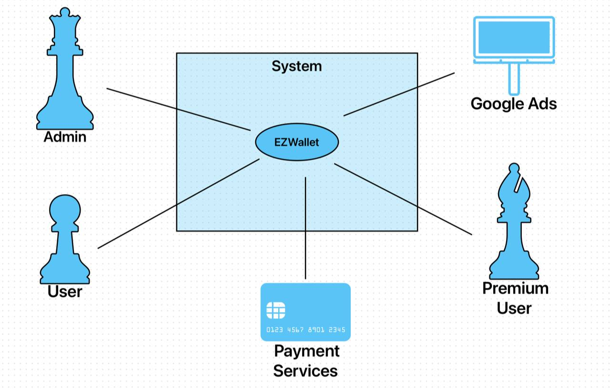
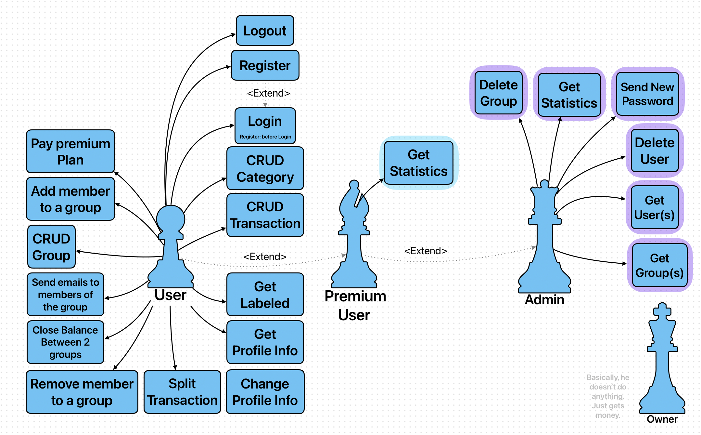
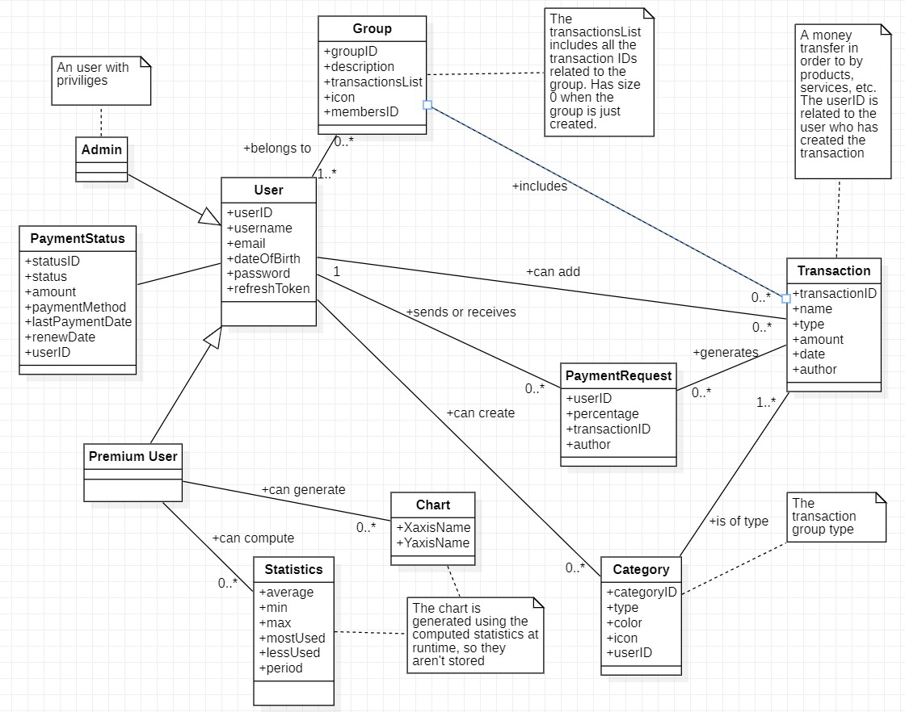
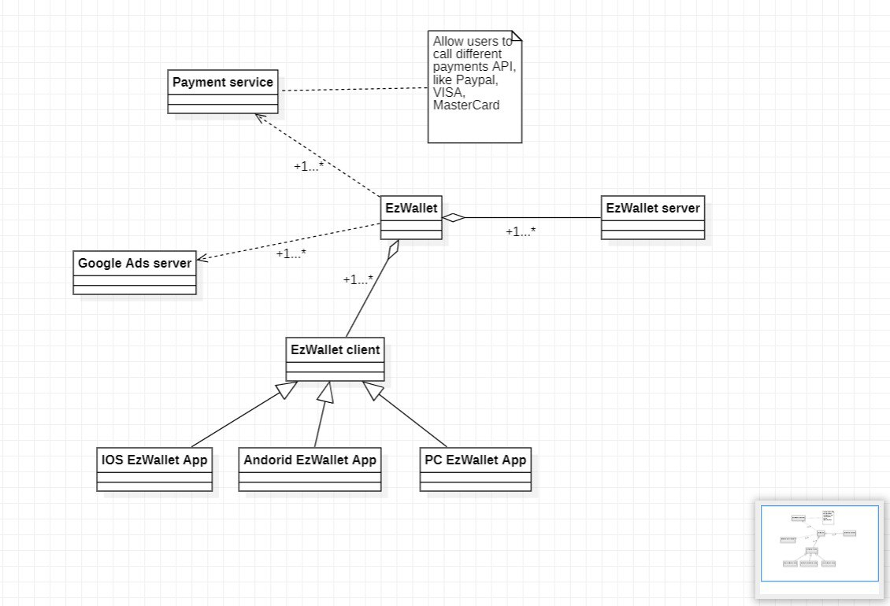
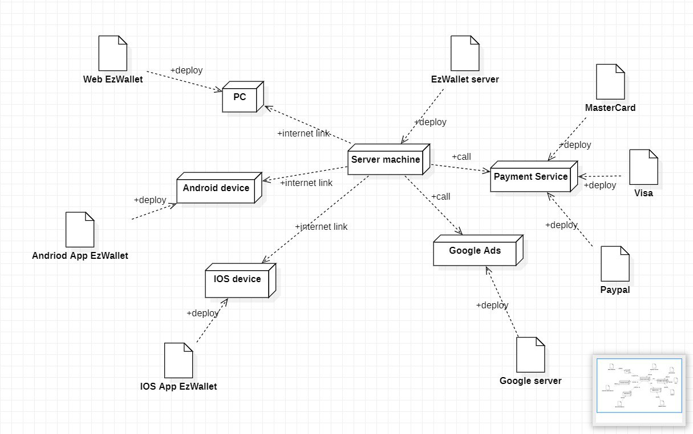

# Requirements Document - future EZWallet

Date:

Version: V2 - description of EZWallet in FUTURE form (as proposed by the team)

| Version number | Change |
|----------------|:-------|
|                |        | 

# Contents

- [Informal description](#informal-description)
- [Stakeholders](#stakeholders)
- [Context Diagram and interfaces](#context-diagram-and-interfaces)
	+ [Context Diagram](#context-diagram)
	+ [Interfaces](#interfaces)

- [Stories and personas](#stories-and-personas)
- [Functional and non functional requirements](#functional-and-non-functional-requirements)
	+ [Functional Requirements](#functional-requirements)
	+ [Non functional requirements](#non-functional-requirements)
- [Use case diagram and use cases](#use-case-diagram-and-use-cases)
	+ [Use case diagram](#use-case-diagram-and-use-cases)
	+ [Use cases](#use-case---register)
		+ [Relevant scenarios](#scenario---register)
- [Glossary](#glossary)
- [System design](#system-design)
- [Deployment diagram](#deployment-diagram)

# Informal description
EZWallet (read EaSy Wallet) is a free software application designed to help individuals and families keep track of their
expenses. Users can enter and categorize their expenses, organizing them into groups they are related to, splitting them
between the group members if needed, allowing them to quickly see where their money is going, showing balances between
members and showing transactions according to the category. Moreover, a premium plan is provided to the users that want
to get more functionalities, such as statistics.

# Stakeholders

| Stakeholder name  | Description                                                                                                       |
|:------------------|:------------------------------------------------------------------------------------------------------------------|
| User              | The normal user of the software application that wants to benefit the main functionality                          |
| Premium User      | The user who pays a subscription fee to use full fledged functionalities                                          |
| Admin             | The user with privileges able to get the list of all the users registered to the application  and also statistics |
| Google ADS        | The API used for the advertisements for the free plan accounts                                                    |
| Payment service   | Payment service to pay the premium plan                                                                           |

# Context Diagram and interfaces

## Context Diagram

## Interfaces

| Actor             |                      Logical Interface                       | Physical Interface |
|:------------------|:------------------------------------------------------------:|:------------------:|
| User              |       GUI (groups management, transaction management)        | Smartphone(v3)/PC  |
| Premium User	     |    GUI (groups management, tran. management, statistics)     | Smartphone(v3)/PC  |
| Admin             |           GUI (Premium user + Account management)            |         PC         |
| Payment services	 |            API (paypal, visa, master card,etc...)            |   Internet link    |
| Google Ads        | API(https://developers.google.com/google-ads/api/docs/start) |   Internet Link    |

# Stories and personas
Persona1: A father of a family that works in a company department, and he is very busy, that bought a house recently, so
he wants to keep track of the family expenses because he has to pay bills and to manage expenses. Story: he wants to note
down all the expenses in order to have a good balance at the end of the month and understand how to manage well his moneys,
don't waste them in useless expenses.

Persona2: a female, single 23yo university student that lives in a small apartment with another girl. She goes regularly
to the gym, she likes meeting with her friends after the lectures, and she really enjoys cooking. She works part-time
during the weekends in a bar in the city centre to save-up for a summer trip with her friends. Although she works, she
has to pay the bills with her housemate and buy groceries, so it is really hard for her to monitor her savings. Story:
she uses EZWallet to keep track of the various transactions that has to split with her housemate.

# Functional and non functional requirements

## Functional Requirements
|   ID   | 							Description        														                                                   |
|:------:|:-------------------------------------------------------------------------------------------|
|  FR1   | AUTHORIZATION AND AUTHENTICATION                  													                            |
| FR1.1  | Register                                    														                                 |
| FR1.2  | Login                                       														                                 |
| FR1.3  | Logout                                      														                                 |
| FR1.4  | Refresh session (refreshToken)              														                                 |
|  FR2   | TRANSACTIONS MANAGEMENT                          													                             |
| FR2.1  | Create category                             														                                 |
| FR2.2  | Get categories                                                                             |
| FR2.3  | Delete categories																					                                                     |
| FR2.4  | Update categories                          														                                  |
| FR2.5  | Create transaction                          														                                 |
| FR2.6  | Get transaction                          														                                    |
| FR2.7  | Delete transaction   		                                                                    |
| FR2.8  | Update transaction                       															                                   |
| FR2.9  | Get labels (transaction + category details) 														                                 |
| FR2.10 | Get profile info                            														                                 |
|  FR3   | ADMIN MANAGEMENT                                                                  				     |
| FR3.1  | Get all users                                                                     				     |
| FR3.2  | Get user                                                                          				     |
| FR3.3  | Delete user                                                                                |
| FR3.4  | Get Groups                                                                                 |
| FR3.3  | Delete group                                                                               |
| FR3.5  | Get Statistics                                                                             |
|  FR4   | ANALYTICS (PREMIUM ONLY)																			                                                |
| FR4.1  | Get statistics (max, min, avg, plots,...)																		                                |	|
|  FR5   | GROUP MANAGEMENT 																					                                                     |
| FR5.1  | Create groups																						                                                        |
| FR5.2  | Select groups																						                                                        |
| FR5.3  | Delete groups																						                                                        |
| FR5.4	 | Add members to a group																			                                                  |
| FR5.5  | Remove members from a group																		                                              |
| FR5.6  | Split transaction amount to group members (equally, by specific persons, by percentage)			 |
|  FR6   | Pay premium plan                                                                           |
|  FR7   | NOTIFICATIONS MANAGEMENT												                                                       |
| FR7.1  | Send notification												                                                              |

## Non Functional Requirements

| ID   | Type (efficiency, reliability, ..) | Description                                                                                                 | Refers to |
|------|:-----------------------------------|:------------------------------------------------------------------------------------------------------------|----------:|
| NFR1 | Usability                          | The GUI must be simple and intuitive                                                                        |    all FR |
| NFR2 | Correctness                        | The amount of the expensive must be equal to the sum of the expenses                                        |    all FR |
| NFR3 | Efficiency                         | The transactions must be fast and the statistical data must be collected quickly by the admin               |    all FR |
| NFR4 | Reliability                        | The software crashes have to be <0.01% of interactions                                                      |    all FR |
| NFR5 | Maintainability                    | The software must be easy to maintain and modular                                                           |    all FR |
| NFR5 | Security                           | Data can only be accessed by authorized users                                                               |    all FR |
| NFR6 | Usability                          | The user must be able to distinguish transaction categories and easily determine the amount of the expenses |    all FR |
| NFR7 | Dependability                      | Information available must be correct, available and consistent                                             |    all FR |
| NFR8 | Security                           | Password must never be stored in clear. Sensitive data must not be saved in clear.                          |    all FR |

# Use case diagram and use cases

### Use case - Register
| Actors Involved  |                             User                              |
|------------------|:-------------------------------------------------------------:|
| Precondition     |                    User registered - False                    |
| Post condition   |                    New User Created - True                    |
| Nominal Scenario |                        User Registered                        |
| Exceptions       | Existing account/email, wrong email/password/username formats |

#### Scenario - Register
| Step |                Description                |
|------|:-----------------------------------------:|
| 1    |           User ask to register            |
| 2    | System asks email, username, and password |
| 3    |         User enter needed values          |
| 4    |   System check email/password validity    |
| 5    |          System creates new user          |

### Use case - Login
| Actors Involved  |                       User                       |
|------------------|:------------------------------------------------:|
| Precondition     |              User registered - True              |
| Post condition   |              User authorized - True              |
| Nominal Scenario |                   User logins                    |
| Exceptions       | Not existing account/email, wrong email/password |

#### Scenario - Login
| Step               |             Description              |
|--------------------|:------------------------------------:|
| 1                  |          User ask to Login           |
| 2                  |    System asks email and password    |
| 3                  |      User enters needed values       |
| 4                  | System check email/password validity |

### Use case - Logout
| Actors Involved  |          User           |
|------------------|:-----------------------:|
| Precondition     | User authorized - True  |
| Post condition   | User authorized - False |
| Nominal Scenario |       User logout       |

#### Scenario - Logout
| Step               |             Description              |
|--------------------|:------------------------------------:|
| 1                  |          User ask to logout          |
| 2                  |         System logouts user          |

### Use case - Create Category
| Actors Involved  |           User            |
|------------------|:-------------------------:|
| Precondition     |  User authorized - True   |
| Post condition   |  Category Created - True  |
| Nominal Scenario | User creates new category |
| Exceptions       |    User not authorized    |

#### Scenario - Create Category
| Step |           Description           |
|------|:-------------------------------:|
| 1    |   User ask to create category   |
| 2    | System asks values(type, color) |
| 3    |    User sends needed values     |
| 4    |     System creates category     |

### Use case - Create Transaction
| Actors Involved  |                   User                    |
|------------------|:-----------------------------------------:|
| Precondition     |          User authorized - True           |
| Post condition   |        Transaction created - True         |
| Nominal Scenario |         User creates transaction          |
| Exceptions       | User not authorized, wrong entered values |

#### Scenario - Create Transaction
| Step |           Description            |
|------|:--------------------------------:|
| 1    |  User ask to create transaction  |
| 2    | System asks user to enter values |
| 3    |    User enters needed values     |
| 3.1  |   User choose needed category    |
| 4    |    System creates transaction    |

### Use case - Get Labeled
| Actors Involved  |                       User                        |
|------------------|:-------------------------------------------------:|
| Precondition     |              User authorized - True               |
| Nominal Scenario | User gets list of transaction grouped by category |
| Exceptions       |                User not authorized                |

#### Scenario - Get Labeled
| Step |                 Description                 |
|------|:-------------------------------------------:|
| 1    |   User ask list of transactions (labeled)   |
| 2    | System sends list of transactions (labeled) |

### Use case - Create Group
| Actors Involved  |          User          |
|------------------|:----------------------:|
| Precondition     | User authorized - True |
| Post condition   |  Group created- True   |
| Nominal Scenario | User creates new group |
| Exceptions       |  User not authorized   |

#### Scenario - Create Group
| Step |           Description            |
|------|:--------------------------------:|
| 1    | User ask system to create group  |
| 2    | System asks user to enter values |
| 3    |        User sends values         |
| 4    |       System creates group       |

### Use case - Add user to a group
| Actors Involved  |                     User                     |
|------------------|:--------------------------------------------:|
| Precondition     |            User authorized - True            |
| Post condition   |      New member added to a group - True      |
| Nominal Scenario |       User adds new member to a group        |
| Exceptions       | User not authorized, entered user not exists |

#### Scenario - Add user to a group
| Step |                 Description                  |
|------|:--------------------------------------------:|
| 1    | User ask system to add new member to a group |
| 2    |     System asks user to user credentials     |
| 3    |            User sends credentials            |
| 4    |         System checks user existence         |
| 5    |          System adds user to group           |

### Use case - Split transaction
| Actors Involved  |                      User                       |
|------------------|:-----------------------------------------------:|
| Precondition     | User authorized - True; Users in a group - True |
| Post condition   |            Transaction split - True             |
| Nominal Scenario |     User splits transaction between members     |
| Exceptions       |    User not authorized, users not in a group    |

#### Scenario - Split transaction
| Step |              Description              |
|------|:-------------------------------------:|
| 1    | User asks system to split transaction |
| 2    |     System asks user how to split     |
| 3    |          User enter details           |
| 4    |             System splits             |

### Use case - Change Profile
| Actors Involved  |                 User                  |
|------------------|:-------------------------------------:|
| Precondition     |        User authorized - True         |
| Post condition   |        Profile details changed        |
| Nominal Scenario |         User changes profile          |
| Exceptions       | User not authorized; Not valid format |

#### Scenario - Change Profile
| Step |                 Description                 |
|------|:-------------------------------------------:|
| 1    |     User asks system to change profile      |
| 2    | System asks user what to change and to what |
| 3    |             User sends details              |
| 4    |     System changes profile of the user      |

### Use case - Pay premium plan
| Actors Involved  |                 User                  |
|------------------|:-------------------------------------:|
| Precondition     |        User authorized - True         |
| Post condition   |      User -> Premium user - True      |
| Nominal Scenario |        User pays premium plan         |
| Exceptions       | User not authorized; Not valid format |

#### Scenario - Pay premium plan
| Step |                  Description                  |
|------|:---------------------------------------------:|
| 1    |        User asks system to change plan        |
| 2    |       System asks user to pay via visa        |
| 3    |            User sends visa details            |
| 4    |   System makes request to make transaction    |
| 5    | System changes profile of the user to premium |

### Use case - Get Statistics (Premium User)
| Actors Involved                        |                  Premium User                  |
|----------------------------------------|:----------------------------------------------:|
| Precondition                           | User authorized - True; User is premium - True |
| Nominal Scenario                       |             User pays premium plan             |
| Exceptions                             |    User not authorized; User is not premium    |

#### Scenario - Get Statistics (Premium User)
| Step |             Description             |
|------|:-----------------------------------:|
| 1    | User asks system to send statistics |
| 2    |      system analyzes user data      |
| 3    |       System sends statistics       |

### Use case - Get Users (Admin)
| Actors Involved  |                   Admin                   |
|------------------|:-----------------------------------------:|
| Precondition     | User authorized - True; User admin - True |
| Nominal Scenario |          User gets list of users          |
| Exceptions       |    User not authorized, user not admin    |

#### Scenario - Get Users (Admin)
| Step |          Description           |
|------|:------------------------------:|
| 1    |    Admin ask list of Users     |
| 2    | System checks if User is admin |
| 3    |   System sends list of Users   |

### Use case - Get Groups (Admin)
| Actors Involved  |                   Admin                   |
|------------------|:-----------------------------------------:|
| Precondition     | User authorized - True; User admin - True |
| Nominal Scenario |         User gets list of Groups          |
| Exceptions       |    User not authorized, user not admin    |

#### Scenario - Get Groups (Admin)
| Step |          Description           |
|------|:------------------------------:|
| 1    |    Admin ask list of Groups    |
| 2    | System checks if User is admin |
| 3    |  System sends list of Groups   |

# Glossary

# System Design

# Deployment Diagram

