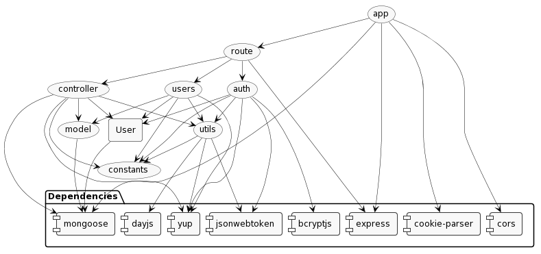

# Test Report

<The goal of this document is to explain how the application was tested, detailing how the test cases were defined and what they cover>

# Contents

- [Dependency graph](#dependency-graph)

- [Integration approach](#integration-approach)

- [Tests](#tests)

- [Coverage](#Coverage)

# Dependency graph
 

# Integration approach

In our project, we adopted a bottom-up approach to testing, incorporating both unit testing and integration testing
to ensure the robustness and reliability of our APIs.
We decided to perform the tests dividing the APIs into 'logical units' according to the actual object of interest which were the following:

- Categories  (**C**)
- Transactions (**T**)
- Users (**U**)
- Utils (**S**)
- Groups (**G**)
- Auth (**A**)

Note: as there are 4 members in our group, we worked in parallel on 4 units per step.

Steps:
1. Unit test:                         | G |  S  | A | T |
2. Unit test:                         | U |  C  | +
   Integration tests:                          | G | S |
3. Integration tests:          | U |  C  | A | T |

# Tests

   <in the table below list the test cases defined For each test report the object tested, the test level (API, integration, unit) and the technique used to define the test case  (BB/ eq partitioning, BB/ boundary, WB/ statement coverage, etc)>   <split the table if needed>

| Number     | Test case name                                                                           | Object(s) tested                 | Test level  | Technique used          |
|------------|------------------------------------------------------------------------------------------|----------------------------------|-------------|-------------------------|
| AUTH       |                                                                                          |                                  |             |                         |
| 1          | it should create a new user successfully                                                 | register                         | unit        | WB / statement coverage |
| 2          | it should fail because of missing or invalid body (username)                             | register                         | unit        | WB / statement coverage |
| 3          | it should fail because of missing or invalid body (email)                                | register                         | unit        | WB / statement coverage |
| 4          | it should fail because of missing or invalid body (password)"                            | register                         | unit        | WB / statement coverage |
| 5          | it should fail because of another user exist with that email/password"                   | register                         | unit        | WB / statement coverage |
| 6          | It should register a normal user                                                         | register                         | integration | BB/ eq partitioning     |
| 7          | It should fail because user already exists                                               | register                         | integration | BB/ eq partitioning     |
| 8          | It should fail for missing email                                                         | register                         | integration | BB/ eq partitioning     |
| 9          | It should fail for missing username                                                      | register                         | integration | BB/ eq partitioning     |
| 10         | It should fail for missing password                                                      | register                         | integration | BB/ eq partitioning     |
| 11         | it should create a new admin successfully                                                | registerAdmin                    | unit        | WB / statement coverage |
| 12         | it should fail because of missing or invalid body (no username)                          | registerAdmin                    | unit        | WB / statement coverage |
| 13         | it should fail because of missing or invalid body (no email)                             | registerAdmin                    | unit        | WB / statement coverage |
| 14         | it should fail because of missing or invalid body (no password)                          | registerAdmin                    | unit        | WB / statement coverage |
| 15         | it should fail because of another user exist with that email/password                    | registerAdmin                    | unit        | WB / statement coverage |
| 16         | It should register an admin user                                                         | registerAdmin                    | integration | BB/ eq partitioning     |
| 17         | It should fail because admin already exists                                              | registerAdmin                    | integration | BB/ eq partitioning     |
| 18         | It should fail for missing email                                                         | registerAdmin                    | integration | BB/ eq partitioning     |
| 19         | It should fail for missing username                                                      | registerAdmin                    | integration | BB/ eq partitioning     |
| 20         | It should fail for missing password                                                      | registerAdmin                    | integration | BB/ eq partitioning     |
| 21         | it should perform the login                                                              | login                            | unit        | WB / statement coverage |
| 22         | it should fail because of missing or invalid body (password)                             | login                            | unit        | WB / statement coverage |
| 23         | it should fail because of missing or invalid body (email)                                | login                            | unit        | WB / statement coverage |
| 24         | it should fail because of invalid credentials                                            | login                            | unit        | WB / statement coverage |
| 25         | it should fail because user does not exist                                               | login                            | unit        | WB / statement coverage |
| 26         | It should perform the login                                                              | login                            | integration | BB/ eq partitioning     |
| 27         | It should fail for missing email                                                         | login                            | integration | BB/ eq partitioning     |
| 28         | It should fail for missing password                                                      | login                            | integration | BB/ eq partitioning     |
| 29         | It should fail for wrong credentials                                                     | login                            | integration | BB/ eq partitioning     | 
| 30         | It should fail for not existing user                                                     | login                            | integration | BB/ eq partitioning     |
| 31         | it should perform the logout                                                             | logout                           | unit        | WB / statement coverage |
| 32         | it should fail because of missing refresh token in cookies                               | logout                           | unit        | WB / statement coverage |
| 33         | it should fail because the cookie does not represent a user in the db                    | logout                           | unit        | WB / statement coverage |
| 34         | It should fail for no refreshToken                                                       | logout                           | integration | BB/ eq partitioning     |
| 35         | It should fail for no user found                                                         | logout                           | integration | BB/ eq partitioning     |
| 36         | It should logout                                                                         | logout                           | integration | BB/ eq partitioning     |
| CONTROLLER |                                                                                          |                                  |             |                         |
| 37         | it should return unauthorized (not admin)                                                | createCategory                   | unit        | WB / statement coverage |
| 38         | it should create a new category                                                          | createCategory                   | unit        | WB / statement coverage |
| 39         | it should fail for missing body fields                                                   | createCategory                   | unit        | WB / statement coverage |
| 40         | it should fail for one or both fields being an empty string                              | createCategory                   | unit        | WB / statement coverage |
| 41         | it should fail for category already existing                                             | createCategory                   | unit        | WB / statement coverage |
| 42         | It should return Unauthorized if not logged                                              | createCategory                   | integration | BB/ eq partitioning     |
| 43         | It should return Unauthorized if not admin logged                                        | createCategory                   | integration | BB/ eq partitioning     |
| 44         | It should create a category                                                              | createCategory                   | integration | BB/ eq partitioning     |
| 45         | It should fail because type lost                                                         | createCategory                   | integration | BB/ eq partitioning     |
| 46         | It should fail because color lost                                                        | createCategory                   | integration | BB/ eq partitioning     |
| 47         | it should fail for missing at least one field being an empty string                      | createCategory                   | integration | BB/ eq partitioning     |
| 48         | It should fail because an existing category                                              | createCategory                   | integration | BB/ eq partitioning     |
| 49         | it should return unauthorized (not admin)                                                | updateCategory                   | unit        | WB / statement coverage |
| 50         | It should fail because of the body missing                                               | updateCategory                   | unit        | WB / statement coverage |
| 51         | it should fail for at least one field being an empty string                              | updateCategory                   | unit        | WB / statement coverage |
| 52         | It should fail for no category found                                                     | updateCategory                   | unit        | WB / statement coverage |
| 53         | It should update the category with no changes                                            | updateCategory                   | unit        | WB / statement coverage |
| 54         | It should update the category with changes                                               | updateCategory                   | unit        | WB / statement coverage |
| 55         | It should update the color of a given category                                           | updateCategory                   | unit        | WB / statement coverage |
| 56         | It should fail for category already existing                                             | updateCategory                   | unit        | WB / statement coverage |
| 57         | It should return Unauthorized if not logged                                              | updateCategory                   | integration | BB/ eq partitioning     |
| 58         | It should return Unauthorized if not admin logged                                        | updateCategory                   | integration | BB/ eq partitioning     |
| 59         | it should fail because not find the category                                             | updateCategory                   | integration | BB/ eq partitioning     |
| 60         | It should fail because type missing                                                      | updateCategory                   | integration | BB/ eq partitioning     |
| 61         | It should fail because color missing                                                     | updateCategory                   | integration | BB/ eq partitioning     |
| 62         | it should fail because missing at least one field being an empty string                  | updateCategory                   | integration | BB/ eq partitioning     |
| 63         | It should change the category successfully with changes                                  | updateCategory                   | integration | BB/ eq partitioning     |
| 64         | it should change the category successfully with no change                                | updateCategory                   | integration | BB/ eq partitioning     |
| 65         | It should change the color only                                                          | updateCategory                   | integration | BB/ eq partitioning     |
| 66         | it should return unauthorized (not admin)                                                | deleteCategory                   | unit        | WB / statement coverage |
| 67         | it should fail for missing attributes                                                    | deleteCategory                   | unit        | WB / statement coverage |
| 68         | it should fail for having only a category in the database                                | deleteCategory                   | unit        | WB / statement coverage |
| 69         | it should fail for at least one of the categories in the body not in the database        | deleteCategory                   | unit        | WB / statement coverage |
| 70         | it should remove all the categories in the array if N>T                                  | deleteCategory                   | unit        | WB / statement coverage |
| 71         | it should remove all the categories except the first one if N=T                          | deleteCategory                   | unit        | WB / statement coverage |
| 72         | It should return Unauthorized if not logged                                              | deleteCategory                   | integration | BB/ eq partitioning     |
| 73         | It should return Unauthorized if not admin logged                                        | deleteCategory                   | integration | BB/ eq partitioning     |
| 74         | it should fail because having only a category in the database                            | deleteCategory                   | integration | BB/ eq partitioning     |
| 75         | it should fail because at least one of the categories in the body not in the database    | deleteCategory                   | integration | BB/ eq partitioning     |
| 76         | It should delete the category                                                            | deleteCategory                   | integration | BB/ eq partitioning     |
| 77         | it should fail if the user is not authenticated (simple auth)                            | getCategories                    | unit        | WB / statement coverage |
| 78         | it should return the categories                                                          | getCategories                    | unit        | WB / statement coverage |
| 79         | it should return null if no category                                                     | getCategories                    | unit        | WB / statement coverage |
| 80         | It should return Unauthorized if not logged                                              | getCategories                    | integration | BB/ eq partitioning     |
| 81         | It should get the categories                                                             | getCategories                    | integration | BB/ eq partitioning     |
| 82         | It should get null because categories is null                                            | getCategories                    | integration | BB/ eq partitioning     |
| 83         | it should create the transaction                                                         | createTransaction                | unit        | WB / statement coverage |
| 84         | it should fail for missing or wrong parameters                                           | createTransaction                | unit        | WB / statement coverage |
| 85         | it should fail for missing at least one field being an empty string                      | createTransaction                | unit        | WB / statement coverage |
| 86         | it should fail if the amount cannot be parsed as a float value                           | createTransaction                | unit        | WB / statement coverage |
| 87         | it should fail for missing category                                                      | createTransaction                | unit        | WB / statement coverage |
| 88         | it should fail for username not equal to the one passed as route parameter               | createTransaction                | unit        | WB / statement coverage |
| 89         | it should fail for user not in the database                                              | createTransaction                | unit        | WB / statement coverage |
| 90         | It should return Unauthorized if not logged                                              | createTransaction                | integration | BB/ eq partitioning     |
| 91         | It should create a transaction                                                           | createTransaction                | integration | BB/ eq partitioning     |
| 92         | it should fail for missing or wrong parameters                                           | createTransaction                | integration | BB/ eq partitioning     |
| 93         | it should fail for missing at least one field being an empty string                      | createTransaction                | integration | BB/ eq partitioning     |
| 94         | it should fail if the amount cannot be parsed as a float value                           | createTransaction                | integration | BB/ eq partitioning     |
| 95         | it should fail if category not in the db                                                 | createTransaction                | integration | BB/ eq partitioning     |
| 96         | it should fail for username not equal to the one passed as route parameter               | createTransaction                | integration | BB/ eq partitioning     |
| 97         | it should fail for not being admin                                                       | getAllTransactions               | unit        | WB / statement coverage |
| 98         | it returns all the transactions                                                          | getAllTransactions               | unit        | WB / statement coverage |
| 99         | it returns an empty array                                                                | getAllTransactions               | unit        | WB / statement coverage |
| 100        | It should return Unauthorized if not logged                                              | getAllTransactions               | integration | BB/ eq partitioning     |
| 101        | It should get all the transactions                                                       | getAllTransactions               | integration | BB/ eq partitioning     |
| 102        | It should fail for not being admin                                                       | getAllTransactions               | integration | BB/ eq partitioning     |
| 103        | it should return  an empty array                                                         | getAllTransactions               | integration | BB/ eq partitioning     |
| 104        | it should fail for an authenticated user not being the same as the one in the route      | getTransactionsByUser            | unit        | WB / statement coverage |
| 105        | it should fail user not in the db                                                        | getTransactionsByUser            | unit        | WB / statement coverage |
| 106        | it should return the transactions (not filtered)                                         | getTransactionsByUser            | unit        | WB / statement coverage |
| 107        | it should return the transactions (filtered by date)                                     | getTransactionsByUser            | unit        | WB / statement coverage |
| 108        | it should return the transactions (filtered by amount)                                   | getTransactionsByUser            | unit        | WB / statement coverage |
| 109        | it should return the transactions (filtered by date and amount)                          | getTransactionsByUser            | unit        | WB / statement coverage |
| 110        | it should fail for not being an admin                                                    | getTransactionsByUser            | unit        | WB / statement coverage |
| 111        | it should return the transactions (not filtered)                                         | getTransactionsByUser            | unit        | WB / statement coverage |
| 112        | it should returns the transactions without applying the filter                           | getTransactionsByUser            | unit        | WB / statement coverage |
| 113        | It should return Unauthorized if not logged                                              | getTransactionsByUser            | integration | BB/ eq partitioning     |
| 114        | It should get the transactions of a user(user)                                           | getTransactionsByUser            | integration | BB/ eq partitioning     |
| 115        | It should get the transactions of a user(filtered by date)                               | getTransactionsByUser            | integration | BB/ eq partitioning     |
| 116        | It should get the transactions of a user(filtered by amount)                             | getTransactionsByUser            | integration | BB/ eq partitioning     |
| 117        | It should get the transactions of a user(filtered by amount and date)                    | getTransactionsByUser            | integration | BB/ eq partitioning     |
| 118        | It should get an empty array if no transactions(user)                                    | getTransactionsByUser            | integration | BB/ eq partitioning     |
| 119        | it should fail for an authenticated user not being the same as the one in the route      | getTransactionsByUser            | integration | BB/ eq partitioning     |
| 120        | it should return unauthorized for not being an admin                                     | getTransactionsByUser            | integration | BB/ eq partitioning     |
| 121        | It should get the transactions of a user(admin)                                          | getTransactionsByUser            | integration | BB/ eq partitioning     |
| 122        | It should get the transactions of a user(filters not applied - admin)                    | getTransactionsByUser            | integration | BB/ eq partitioning     |
| 123        | it should fail for an authenticated user not being the same as the one in the route      | getTransactionsByUserByCategory  | unit        | WB / statement coverage |
| 124        | it should return an empty array                                                          | getTransactionsByUserByCategory  | unit        | WB / statement coverage |
| 125        | it should return the transactions                                                        | getTransactionsByUserByCategory  | unit        | WB / statement coverage |
| 126        | it should fail for not existing user                                                     | getTransactionsByUserByCategory  | unit        | WB / statement coverage |
| 127        | it should fail for not existing category                                                 | getTransactionsByUserByCategory  | unit        | WB / statement coverage |
| 128        | it should return unauthorized if the authenticated user is not an admin                  | getTransactionsByUserByCategory  | unit        | WB / statement coverage |
| 129        | it should return the transactions                                                        | getTransactionsByUserByCategory  | unit        | WB / statement coverage |
| 130        | It should return Unauthorized if not logged                                              | getTransactionsByUserByCategory  | integration | BB/ eq partitioning     |
| 131        | It should get the transactions of a given user and category pair                         | getTransactionsByUserByCategory  | integration | BB/ eq partitioning     |
| 132        | It should get an empty array if no transactions for that category                        | getTransactionsByUserByCategory  | integration | BB/ eq partitioning     |
| 133        | It should fail if the category not in the database                                       | getTransactionsByUserByCategory  | integration | BB/ eq partitioning     |
| 134        | It should fail if the user is not an admin                                               | getTransactionsByUserByCategory  | integration | BB/ eq partitioning     |
| 135        | it should return the transactions                                                        | getTransactionsByGroup           | unit        | WB / statement coverage |
| 136        | it should fail if the user is not part of that group                                     | getTransactionsByGroup           | unit        | WB / statement coverage |
| 137        | it should fail if the group does not exist                                               | getTransactionsByGroup           | unit        | WB / statement coverage |
| 138        | it should fail if the group name parameter is missing or empty                           | getTransactionsByGroup           | unit        | WB / statement coverage |
| 139        | it should return an empty list if there are no transactions in the group                 | getTransactionsByGroup           | unit        | WB / statement coverage |
| 140        | it should fail if not admin                                                              | getTransactionsByGroup           | unit        | WB / statement coverage |
| 141        | it should return the transactions(admin)                                                 | getTransactionsByGroup           | unit        | WB / statement coverage |
| 142        | It should get the transactions of all the members of a group                             | getTransactionsByGroup           | integration | BB/ eq partitioning     |
| 143        | It should get an empty array if no transactions in that group                            | getTransactionsByGroup           | integration | BB/ eq partitioning     |
| 144        | It should return unauthorized cause user not in the group                                | getTransactionsByGroup           | integration | BB/ eq partitioning     |
| 145        | It should return unauthorized for not been admin                                         | getTransactionsByGroup           | integration | BB/ eq partitioning     |
| 146        | It should return Group does not exist                                                    | getTransactionsByGroup           | integration | BB/ eq partitioning     |
| 147        | it should fail if user is not part of the group                                          | getTransactionsByGroupByCategory | unit        | WB / statement coverage |
| 148        | it should fail if the group does not exist                                               | getTransactionsByGroupByCategory | unit        | WB / statement coverage |
| 149        | it should fail if the category does not exist                                            | getTransactionsByGroupByCategory | unit        | WB / statement coverage |
| 150        | it should fail if some parameter is missing or empty                                     | getTransactionsByGroupByCategory | unit        | WB / statement coverage |
| 151        | it should return all the transactions                                                    | getTransactionsByGroupByCategory | unit        | WB / statement coverage |
| 152        | it should fail if not admin                                                              | getTransactionsByGroupByCategory | unit        | WB / statement coverage |
| 153        | It should get the transactions of all the members of a group filtered by category        | getTransactionsByGroupByCategory | integration | BB/ eq partitioning     |
| 154        | It should return unauthorized if user not part of the group                              | getTransactionsByGroupByCategory | integration | BB/ eq partitioning     |
| 155        | It should return group doesn't exist if group does not exist                             | getTransactionsByGroupByCategory | integration | BB/ eq partitioning     |
| 156        | It should return Category not found if the category does not exist                       | getTransactionsByGroupByCategory | integration | BB/ eq partitioning     |
| 157        | It should return unauthorized if not an admin                                            | getTransactionsByGroupByCategory | integration | BB/ eq partitioning     |
| 158        | it should fail if the user is not the same as the one on the route                       | deleteTransaction                | unit        | WB / statement coverage |
| 159        | it should fail if the transaction doesn't belong to the requesting user                  | deleteTransaction                | unit        | WB / statement coverage |
| 160        | it should fail if the user does not exist                                                | deleteTransaction                | unit        | WB / statement coverage |
| 161        | it should fail if _id is missing                                                         | deleteTransaction                | unit        | WB / statement coverage |
| 162        | it should fail if _id is an empty string                                                 | deleteTransaction                | unit        | WB / statement coverage |
| 163        | it should fail if the transaction does not exist                                         | deleteTransaction                | unit        | WB / statement coverage |
| 164        | it should return a success message                                                       | deleteTransaction                | unit        | WB / statement coverage |
| 165        | it should fail for invalid _id                                                           | deleteTransaction                | unit        | WB / statement coverage |
| 166        | It should delete a transaction                                                           | deleteTransaction                | integration | BB/ eq partitioning     |
| 167        | It should return Cannot delete the transaction corresponding to _id: ${_id}              | deleteTransaction                | integration | BB/ eq partitioning     |
| 168        | It should return The _id is required if not provided                                     | deleteTransaction                | integration | BB/ eq partitioning     |
| 169        | It should return Transaction does not exist if the provided _id is not in the db         | deleteTransaction                | integration | BB/ eq partitioning     |
| 170        | it should return a success message                                                       | deleteTransactions               | unit        | WB / statement coverage |
| 171        | it should fail if not admin                                                              | deleteTransactions               | unit        | WB / statement coverage |
| 172        | it should fail if array of _id is missing                                                | deleteTransactions               | unit        | WB / statement coverage |
| 173        | it should fail if array of _id is empty                                                  | deleteTransactions               | unit        | WB / statement coverage |
| 174        | it should fail if at least one _id is an empty string                                    | deleteTransactions               | unit        | WB / statement coverage |
| 175        | it should fail if at least one _id is not on the db                                      | deleteTransactions               | unit        | WB / statement coverage |
| 176        | it should fail for invalid _id                                                           | deleteTransactions               | unit        | WB / statement coverage |
| 177        | It should delete a list of transactions                                                  | deleteTransactions               | integration | BB/ eq partitioning     |
| 178        | It should return _ids cannot be empty strings                                            | deleteTransactions               | integration | BB/ eq partitioning     |
| 179        | It should return No _ids provided if the _ids array is empty                             | deleteTransactions               | integration | BB/ eq partitioning     |
| 180        | It should return Transaction not found if it isn't in the db                             | deleteTransactions               | integration | BB/ eq partitioning     |
| 181        | It should return unauthorized if not an admin                                            | deleteTransactions               | integration | BB/ eq partitioning     |
| USERS      |                                                                                          |                                  |             |                         |
| 182        | it should be unauthorized if not admin                                                   | getUsers                         | unit        | WB / statement coverage |
| 183        | it should return empty list if there are no users                                        | getUsers                         | unit        | WB / statement coverage |
| 184        | it should retrieve list of all users                                                     | getUsers                         | unit        | WB / statement coverage |
| 185        | it should return empty list if there are no users                                        | getUsers                         | integration | BB/ eq partitioning     |
| 186        | it should retrieve list of all users                                                     | getUsers                         | integration | BB/ eq partitioning     |
| 187        | it should return user detail                                                             | getUser                          | unit        | WB / statement coverage |
| 188        | it should fail, if user is not the same as the route (user)                              | getUser                          | unit        | WB / statement coverage |
| 189        | it should fail, if user not found                                                        | getUser                          | unit        | WB / statement coverage |
| 190        | it should return user details if not the same as the route (admin)                       | getUser                          | unit        | WB / statement coverage |
| 191        | it should fail, if user not found                                                        | getUser                          | unit        | WB / statement coverage |
| 192        | it should be unauthorized (no cookies)                                                   | getUser                          | integration | BB/ eq partitioning     |
| 193        | it should be unauthorized (for asking another user's data while being regular user)      | getUser                          | integration | BB/ eq partitioning     |
| 194        | it should get own user's data                                                            | getUser                          | integration | BB/ eq partitioning     |
| 195        | it should get another user's data (admin)                                                | getUser                          | integration | BB/ eq partitioning     |
| 196        | it should fail for asking not existing user's data (admin)                               | getUser                          | integration | BB/ eq partitioning     |
| 197        | it should create the group                                                               | createGroup                      | unit        | WB / statement coverage |
| 198        | it should fail if user is not authenticated                                              | createGroup                      | unit        | WB / statement coverage |
| 199        | it should fail for field missing                                                         | createGroup                      | unit        | WB / statement coverage |
| 200        | it should fail if name is an empty string                                                | createGroup                      | unit        | WB / statement coverage |
| 201        | it should fail for at least a field being an empty string                                | createGroup                      | unit        | WB / statement coverage |
| 202        | it should fail if all emails are not valid users or already part of other groups         | createGroup                      | unit        | WB / statement coverage |
| 203        | it should fail if the calling user is part of a group                                    | createGroup                      | unit        | WB / statement coverage |
| 204        | it should fail if group with same name exists                                            | createGroup                      | unit        | WB / statement coverage |
| 205        | it should fail if at least one email is not a valid email (wrong format)                 | createGroup                      | unit        | WB / statement coverage |
| 206        | it should fail if at least one email is an empty string                                  | createGroup                      | unit        | WB / statement coverage |
| 207        | it should be unauthorized                                                                | createGroup                      | integration | BB/ eq partitioning     |
| 208        | it should create a group                                                                 | createGroup                      | integration | BB/ eq partitioning     |
| 209        | it should not create a group (only 1 user)                                               | createGroup                      | integration | BB/ eq partitioning     |
| 210        | it should not create a group (at least one email is invalid)                             | createGroup                      | integration | BB/ eq partitioning     |
| 211        | it should not create a group (no valid user except the caller)                           | createGroup                      | integration | BB/ eq partitioning     |
| 212        | it should fail for already existing group                                                | createGroup                      | integration | BB/ eq partitioning     |
| 213        | it should add the caller to the group even if not in the array                           | createGroup                      | integration | BB/ eq partitioning     |
| 214        | it should return all the groups                                                          | getGroups                        | unit        | WB / statement coverage |
| 215        | it should fail for not being admin                                                       | getGroups                        | unit        | WB / statement coverage |
| 216        | it should be unauthorized (no cookies)                                                   | getGroups                        | integration | BB/ eq partitioning     |
| 217        | it should be unauthorized (no admin)                                                     | getGroups                        | integration | BB/ eq partitioning     |
| 218        | it should get an empty list                                                              | getGroups                        | integration | BB/ eq partitioning     |
| 219        | it should get the list of groups                                                         | getGroups                        | integration | BB/ eq partitioning     |
| 220        | it should return the group                                                               | getGroup                         | unit        | WB / statement coverage |
| 221        | it should fail if not authenticated (group)                                              | getGroup                         | unit        | WB / statement coverage |
| 222        | it should fail if group does not exist                                                   | getGroup                         | unit        | WB / statement coverage |
| 223        | it return the group if admin (part of the group)                                         | getGroup                         | unit        | WB / statement coverage |
| 224        | it return the group if admin (not part of the group)                                     | getGroup                         | unit        | WB / statement coverage |
| 225        | it should be unauthorized (no cookies)                                                   | getGroup                         | integration | BB/ eq partitioning     |
| 226        | it should be unauthorized not part of the group (not admin)                              | getGroup                         | integration | BB/ eq partitioning     |
| 227        | it should fail for not existing group                                                    | getGroup                         | integration | BB/ eq partitioning     |
| 228        | it should be authorized even if not part of the group (admin)                            | getGroup                         | integration | BB/ eq partitioning     |
| 229        | it should add users to group (user)                                                      | addToGroup                       | unit        | WB / statement coverage |
| 230        | it should fail if not part of the group                                                  | addToGroup                       | unit        | WB / statement coverage |
| 231        | it should add users to group (admin)                                                     | addToGroup                       | unit        | WB / statement coverage |
| 232        | it should fail if not admin                                                              | addToGroup                       | unit        | WB / statement coverage |
| 233        | it should fail if group does not exist                                                   | addToGroup                       | unit        | WB / statement coverage |
| 234        | it should fail if body does not contain all the fields                                   | addToGroup                       | unit        | WB / statement coverage |
| 235        | it should fail if all the provided emails are already in a group or do not exist         | addToGroup                       | unit        | WB / statement coverage |
| 236        | it should fail if at least one email is not in a valid format                            | addToGroup                       | unit        | WB / statement coverage |
| 237        | it should fail if at least one email is an empty string                                  | addToGroup                       | unit        | WB / statement coverage |
| 238        | it should fail for not being an admin(admin route)                                       | addToGroup                       | integration | BB/ eq partitioning     |
| 239        | it should fail if not part of the group(group route)                                     | addToGroup                       | integration | BB/ eq partitioning     |
| 240        | it should fail if part of the body is missing                                            | addToGroup                       | integration | BB/ eq partitioning     |
| 241        | it should fail if group does not exist                                                   | addToGroup                       | integration | BB/ eq partitioning     |
| 242        | it should add to group                                                                   | addToGroup                       | integration | BB/ eq partitioning     |
| 243        | it should fail if authenticated user is not part of the group                            | removeFromGroup                  | unit        | WB / statement coverage |
| 244        | it should fail if not admin                                                              | removeFromGroup                  | unit        | WB / statement coverage |
| 245        | it should fail if group does not exist                                                   | removeFromGroup                  | unit        | WB / statement coverage |
| 246        | it should fail if body does not contain all the fields                                   | removeFromGroup                  | unit        | WB / statement coverage |
| 247        | it should fail if all the provided emails do not belong to the group or do not exist     | removeFromGroup                  | unit        | WB / statement coverage |
| 248        | it should fail if at least one email is not in a valid format                            | removeFromGroup                  | unit        | WB / statement coverage |
| 249        | it should fail if at least one email is an empty string                                  | removeFromGroup                  | unit        | WB / statement coverage |
| 250        | it should fail if the group contains only one member                                     | removeFromGroup                  | unit        | WB / statement coverage |
| 251        | it should remove an user from a group                                                    | removeFromGroup                  | unit        | WB / statement coverage |
| 252        | it should remove an user from a group and one not found                                  | removeFromGroup                  | unit        | WB / statement coverage |
| 253        | it should remove an user from a group and one not in group                               | removeFromGroup                  | unit        | WB / statement coverage |
| 254        | it should remove all the users except the first one                                      | removeFromGroup                  | unit        | WB / statement coverage |
| 255        | it should fail for not existing group                                                    | removeFromGroup                  | integration | BB/ eq partitioning     |
| 256        | it should fail for missing body                                                          | removeFromGroup                  | integration | BB/ eq partitioning     |
| 257        | it should fail for not being part of the group                                           | removeFromGroup                  | integration | BB/ eq partitioning     |
| 258        | it should fail for not being admin                                                       | removeFromGroup                  | integration | BB/ eq partitioning     |
| 259        | it should fail for all users not in group or not found                                   | removeFromGroup                  | integration | BB/ eq partitioning     |
| 260        | it should delete all the users but but not the first one                                 | removeFromGroup                  | integration | BB/ eq partitioning     |
| 261        | it should delete all the users requested                                                 | removeFromGroup                  | integration | BB/ eq partitioning     |
| 262        | it should fail to delete the last user of a group                                        | removeFromGroup                  | integration | BB/ eq partitioning     |
| 263        | it should fail if not admin                                                              | deleteUser                       | unit        | WB / statement coverage |
| 264        | it should delete the user successfully                                                   | deleteUser                       | unit        | WB / statement coverage |
| 265        | it should fail because of missing fields in the body                                     | deleteUser                       | unit        | WB / statement coverage |
| 266        | it should fail if email is not in a valid format                                         | deleteUser                       | unit        | WB / statement coverage |
| 267        | it should fail if email is an empty string                                               | deleteUser                       | unit        | WB / statement coverage |
| 268        | it should fail if the email does not belong to any user in the db                        | deleteUser                       | unit        | WB / statement coverage |
| 269        | if the user is the last member of a group the group must be deleted                      | deleteUser                       | unit        | WB / statement coverage |
| 270        | it should be unauthorized (no cookies)                                                   | deleteUser                       | integration | BB/ eq partitioning     |
| 271        | it should fail (for not existing user)                                                   | deleteUser                       | integration | BB/ eq partitioning     |
| 272        | it should delete user                                                                    | deleteUser                       | integration | BB/ eq partitioning     |
| 273        | it should delete the group successfully                                                  | deleteGroup                      | unit        | WB / statement coverage |
| 274        | it should fail if not admin                                                              | deleteGroup                      | unit        | WB / statement coverage |
| 275        | it should fail if there is no group with that name                                       | deleteGroup                      | unit        | WB / statement coverage |
| 276        | it should fail if there are missing fields in the body                                   | deleteGroup                      | unit        | WB / statement coverage |
| 277        | it should fail if the name is an empty string                                            | deleteGroup                      | unit        | WB / statement coverage |
| 278        | it should delete the group                                                               | deleteGroup                      | integration | BB/ eq partitioning     |
| 279        | it should be unauthorized (not admin)                                                    | deleteGroup                      | integration | BB/ eq partitioning     |
| 280        | it should fail for empty /not valid body                                                 | deleteGroup                      | integration | BB/ eq partitioning     |
| UTILS      |                                                                                          |                                  |             |                         |
| 281        | it should return a filter with only gte (from)                                           | handleDateFilterParams           | unit        | WB / statement coverage |
| 282        | it should return a filter with only lte (upTo)                                           | handleDateFilterParams           | unit        | WB / statement coverage |
| 283        | it should return a filter with both gte and lte (from+upTo)                              | handleDateFilterParams           | unit        | WB / statement coverage |
| 284        | it should return a filter with both gte and lte (date)                                   | handleDateFilterParams           | unit        | WB / statement coverage |
| 285        | it should THROW and error because of invalid date (whatsoever)                           | handleDateFilterParams           | unit        | WB / statement coverage |
| 286        | it should THROW and error because of invalid date (2021-02-31)                           | handleDateFilterParams           | unit        | WB / statement coverage |
| 287        | it should THROW and error because from is after upTo                                     | handleDateFilterParams           | unit        | WB / statement coverage |
| 288        | it should THROW and error because of presence of from and date                           | handleDateFilterParams           | unit        | WB / statement coverage |
| 289        | it should THROW and error because of presence of upTo and date                           | handleDateFilterParams           | unit        | WB / statement coverage |
| 290        | it should THROW and error because of presence of upTo, from and date                     | handleDateFilterParams           | unit        | WB / statement coverage |
| 291        | it should authorize a user given the correct cookie                                      | verifyAuth                       | unit        | WB / statement coverage |
| 292        | it should authorize a user given the correct cookie and username                         | verifyAuth                       | unit        | WB / statement coverage |
| 293        | it should authorize an admin given the correct cookie                                    | verifyAuth                       | unit        | WB / statement coverage |
| 294        | it should authorize an user given the correct cookie and group emails                    | verifyAuth                       | unit        | WB / statement coverage |
| 295        | it should not authorize an user given the correct cookie and group emails                | verifyAuth                       | unit        | WB / statement coverage |
| 296        | it should not authorize and ask to perform login again through the refreshedTokenMessage | verifyAuth                       | unit        | WB / statement coverage |
| 297        | it should not authorize an if at least one of refresh token or access token is missing   | verifyAuth                       | unit        | WB / statement coverage |
| 298        | it should not authorize an if accessToken is missing information (access missing info)   | verifyAuth                       | unit        | WB / statement coverage |
| 299        | it should not authorize an if accessToken is missing information (refresh missing info)  | verifyAuth                       | unit        | WB / statement coverage |
| 300        | it should not authorize an the tokens are mismatched (different user/email/id)           | verifyAuth                       | unit        | WB / statement coverage |
| 301        | it should authorize and refresh the expired accessToken                                  | verifyAuth                       | unit        | WB / statement coverage |
| 302        | it should return a filter with min                                                       | handleAmountFilterParams         | unit        | WB / statement coverage |
| 303        | it should return a filter with max                                                       | handleAmountFilterParams         | unit        | WB / statement coverage |
| 304        | it should return a filter with min and max                                               | handleAmountFilterParams         | unit        | WB / statement coverage |
| 305        | it should return a filter with min and max using negative numbers                        | handleAmountFilterParams         | unit        | WB / statement coverage |
| 306        | it should THROW an error if one of min/max is not a floating point                       | handleAmountFilterParams         | unit        | WB / statement coverage |

# Coverage

## Coverage of FR

<Report in the following table the coverage of  functional requirements (from official requirements)>

| Functional Requirements covered | Test (s)                           | 
|:--------------------------------|:-----------------------------------|
| FR1                             | 288-298 ,1-36                      | 
| FR11                            | 1-10                               | 
| FR12                            | 21-30                              | 
| FR13                            | 31-36                              | 
| FR14                            | 11-20                              | 
| FR15                            | 179-183, 288-298                   | 
| FR16                            | 184-193, 288-298                   | 
| FR17                            | 260-269, 288-298                   | 
| FR2                             | 194-277, 288-298                   | 
| FR21                            | 194-210, 288-298                   | 
| FR22                            | 211-216, 288-298                   | 
| FR23                            | 217-225, 288-298                   | 
| FR24                            | 216-239, 288-298                   | 
| FR26                            | 240-259, 288-298                   | 
| FR28                            | 260-277, 288-298                   | 
| FR3                             | 288-298, 83-181                    | 
| FR31                            | 288-298, 83-96                     | 
| FR32                            | 288-298, 97-103                    | 
| FR33                            | 288-298, 104-122, 278-287, 299-303 | 
| FR34                            | 288-298, 123-134                   | 
| FR35                            | 288-298, 135-146                   | 
| FR36                            | 288-298, 147-157                   | 
| FR37                            | 288-298, 158-169                   | 
| FR38                            | 288-298, 170-181                   | 
| FR4                             | 288-298, 37-82                     | 
| FR41                            | 288-298, 37-48                     | 
| FR42                            | 288-298, 49-65                     | 
| FR43                            | 288-298, 66-76                     | 
| FR44                            | 288-298, 77-82                     | 

## Coverage white box

